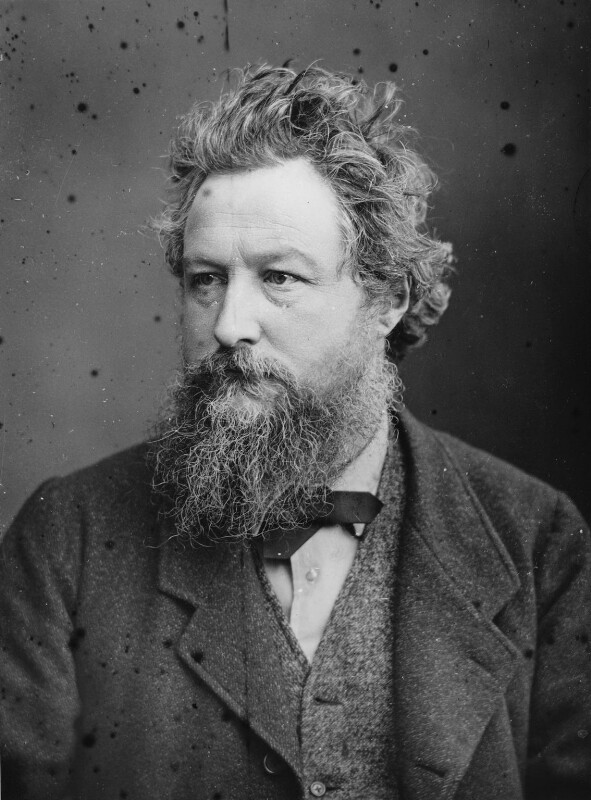
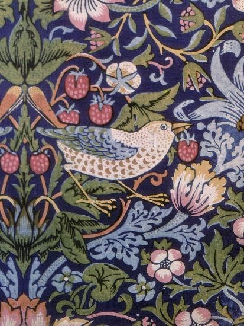
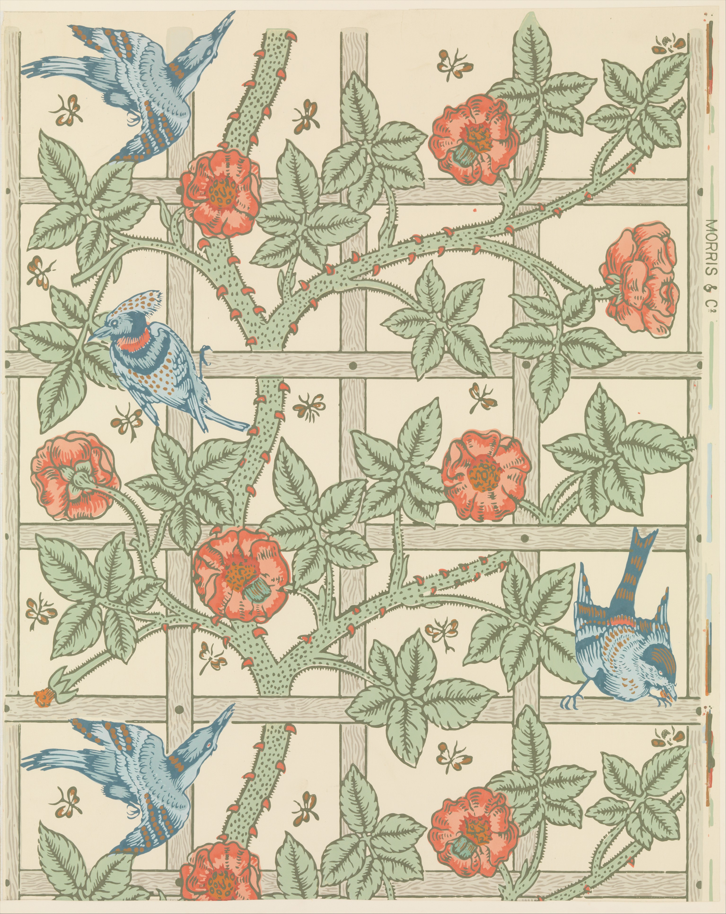
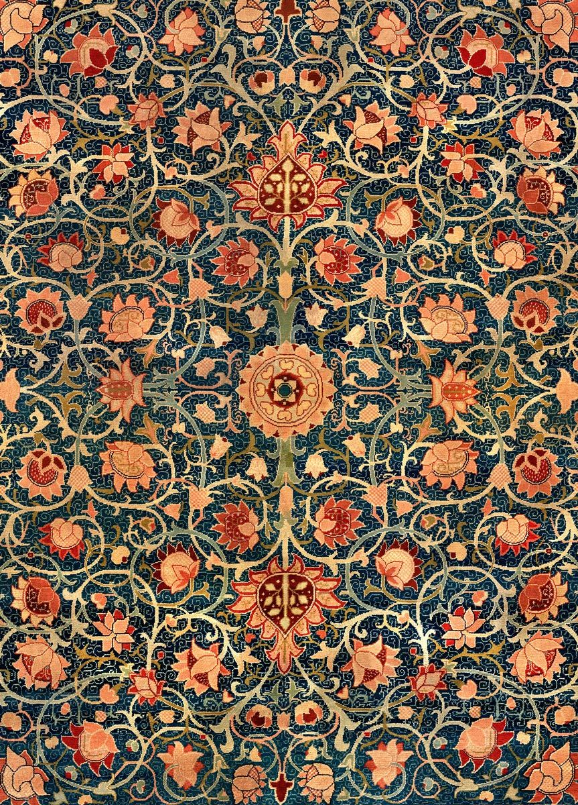
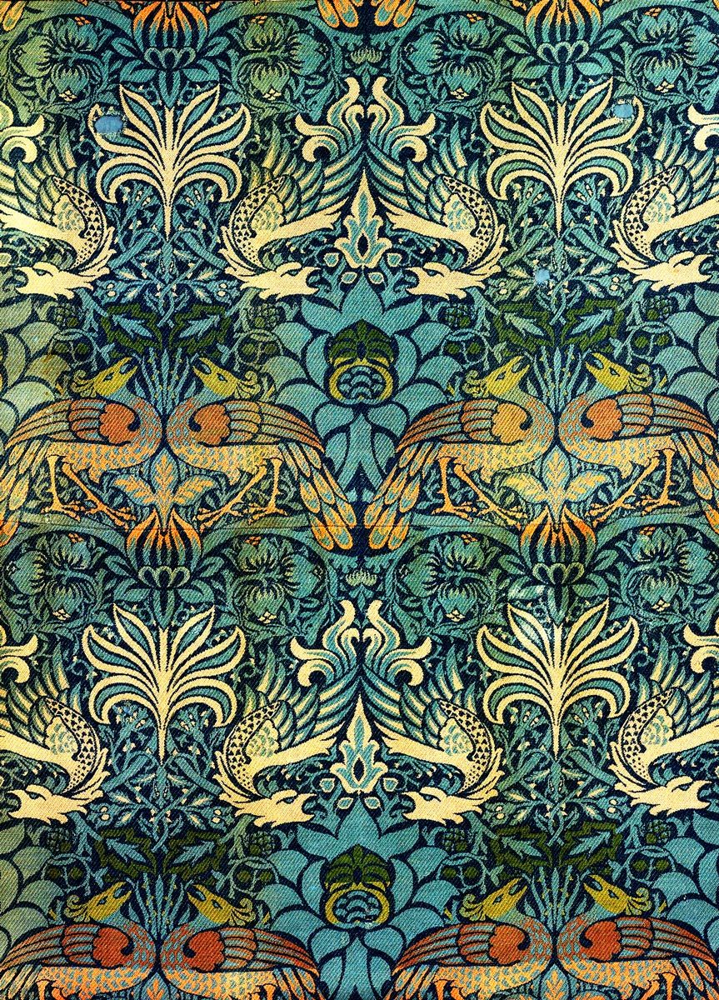
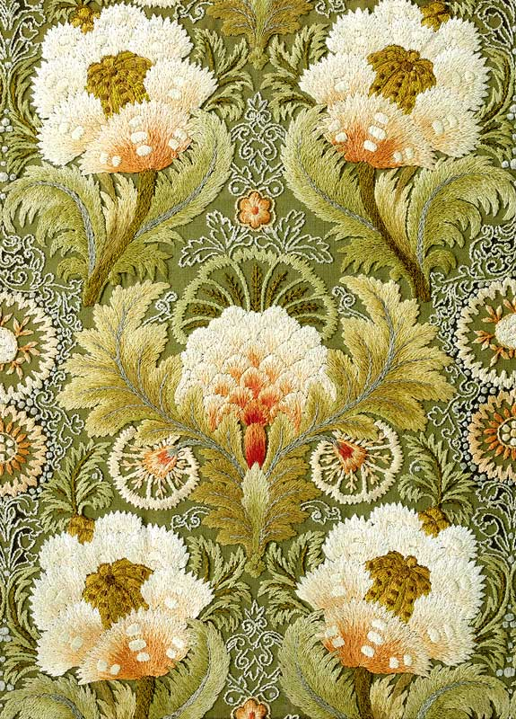
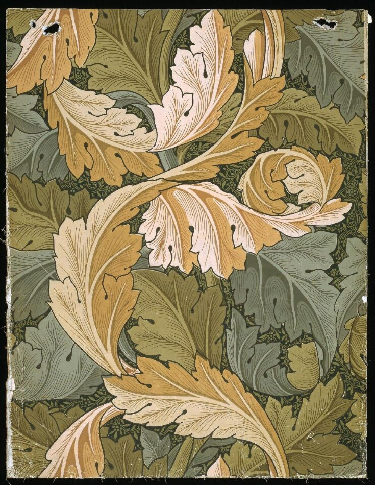

William Morris Colour Palettes for ggplot2 
================
Christian S. Hoggard

# Introduction

This package provides a number of palettes for ggplot2 inspired by the British textile designer, poet, novelist and activity [William Morris](https://en.wikipedia.org/wiki/William_Morris). William Morris (1834-1896) was a major contributor to the revival of traditional British textile arts and is best associated with the [British Arts and Crafts movement](https://en.wikipedia.org/wiki/Arts_and_Crafts_movement). Rooted in the [Modern Style (British Art Nouveau)](https://en.wikipedia.org/wiki/Modern_Style_(British_Art_Nouveau_style)), the Arts and Crafts movement was known for traditional craftsmanship, often using medieval, romantic and folk styles of decoration. Known for its advocation of economic and social reform, the movement was strongly anti-industrial, and prior to the 1930s had a strong influence on the arts in Europe.  

Here, palettes are constructed from six of William Morris' most famous works: 

- **Strawberry Thief** (1883). V&A Museum no. T.586-1919.  

  

- **Trellis** (1864). V&A Museum no. E.452-1919. 
  

- **Holland Park** (1883). Met Museum no. 27.139.3.  
  

- **Peacock and Dragons** (1878). WMG no. F26e.  
  

- **Embroidery with Flowers and Leaves (Leek Embroidery Society)** (1885-1895). Rijksmuseum no. BK-1994-28.  
  

- **Acanthus** (1875). V&A Museum no. E.496-1919. 

## Colour Palettes  

All colour palettes were extracted from images of original works using the `magick` and `imager` packages.

### Strawberry Thief (1883)  

### Trellis (1864)  

### Holland Park (1883)  

### Peacock and Dragons (1878)  

### Embroider with Flowers and Leaves (1885-1895)  

### Acanthus (1875)
